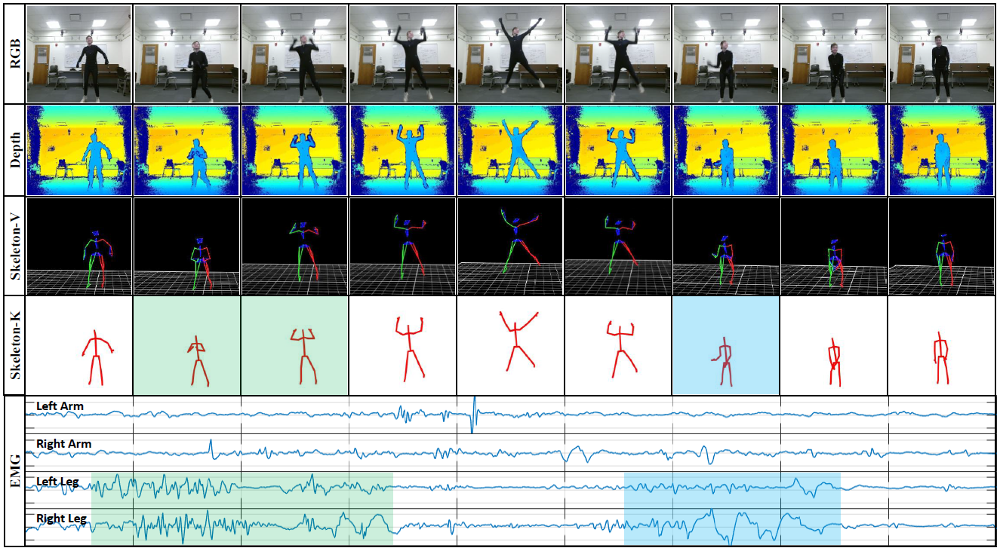
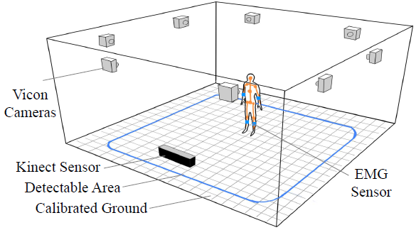
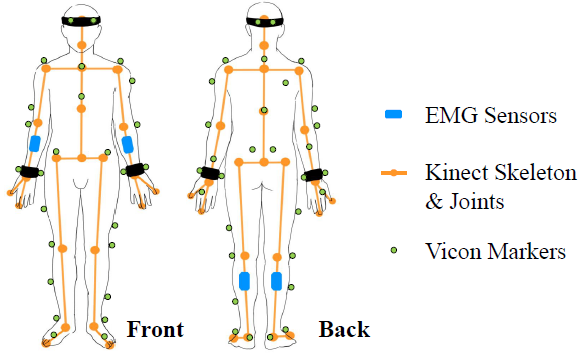

# EV-Action: Electromyography Vision Multi-Modal Action Dataset
This repository contains code for our IEEE International Conference on Automatic Face and Gesture Recognition (FG) paper: [EV-Action: Electromyography Vision Multi-Modal Action Dataset](https://arxiv.org/abs/1904.12602).

## Our paper
### Introduction

Multi-modal human action analysis is a critical and attractive research topic. However, the majority of the existing datasets only provide visual modalities (i.e., RGB, depth and skeleton). 

<div align="center">
    
</div>

To make up this, we introduce a new, large-scale EV-Action dataset in this work, which  consists of RGB, depth, electromyography (EMG), and two skeleton modalities. Compared with the conventional datasets, EV-Action dataset has two major improvements: (1) we deploy a motion capturing system to obtain high quality skeleton modality, which provides more comprehensive motion information including skeleton, trajectory, acceleration with higher accuracy, sampling frequency, and more skeleton markers. (2) we introduce an EMG modality which is usually used as an effective indicator in the biomechanics area, also it has yet to be well explored in motion related research. To the best of our knowledge, this is the first action dataset with EMG modality. The details of EV-Action dataset are clarified, meanwhile, a simple yet effective framework for EMG-based action recognition is proposed. Moreover, state-of-the-art baselines are applied to evaluate the effectiveness of each modality. The obtained result clearly shows the validity of EMG modality in human action analysis tasks. We hope this dataset can make significant contributions to human motion analysis, computer vision, machine learning, biomechanics, and other interdisciplinary fields.

* We designed and constructed a data collection center with optical tracking system and Kinect-V2 systems. This allowed us to capture the four visual modalities (i.e., RGB, Depth, Skeleton-K, and Skeleton-V).
* EMG signal from skeletal muscles is extracted. This is the first action dataset including EMG, which provides complimentary information and reveals valuable correlations between visual and non-visual modalities.
* A simple yet effective EMG recognition framework is proposed which achieves highest performance and reveals unique characteristics of EMG in human actions.
* We defined experimental settings and provided the state-of-the-art benchmarks for each modality. EMG is merged with other modalities which further demonstrates the complementary of the EMG modal.

### Data Collection
Data Collection Center consists of 8 the Vicon cameras placed around the parameter of a 4.6m by 4.6m room which has a detectable area of 3m by 3m. All traceable markers fell in the Vicon cameras field of view. There was a single Kinect sensor centered facing front, and each action was performed with the face of this Kinect sensor as the front. 4 EMG sensors were connected to each subject.

<div align="center">
    
</div>

We deploy 8 Vicon-T40s infrared cameras to capture the stickup marks on each subject. The cameras sample data points as 10-bit gray-scale frames at 100 fps and with a resolution of 2336 by 1728. Then, the frames were calibrated and labeled to obtain skeleton information. We follow the standard scheme by placing 39 markers around human body. It captures precise and comprehensive motion information, such as the second bounce in the Fall Down action class. We deploy wireless EMG sensors which captures 16-bit EMG signal at 1000 Hz. This enables the sensors to cover the whole frequency spectrum of skeletal EMG (i.e., 20-450 Hz) signal. We attached 4 sensors to each subject: the middle of each forearm and the shank muscles. There are 3 reasons: 1), the common actions usually utilize arms and legs; 2), the location of each muscle (mid-line of the muscle in the belly that is between the nearest innervation zone and the myotendinous junction) gives off a signal of highest amplitude, which makes the signal most responsive to the corresponding action; 3), the crosstalk noise generated by neighboring muscles has the potential to get misinterpreted for originating from a muscle of interest, and placing the sensor mid-line makes it less susceptible to this noise.

<div align="center">
    
</div>

## Baseline Code
The dataset and code will be available soon. Feel free to send email if you have any questions!

## EV-Action Dataset
The dataset and code will be available soon. Feel free to send email if you have any questions!

## Authors
Welcome to send us Emails if you have any questions about the code and our work :-)
* **Lichen Wang** [Website](https://sites.google.com/site/lichenwang123/)
* **Bin Sun**
* **Joseph Robinson** [Website](https://www.jrobsvision.com/)
* **Taotao Jing** [Website](https://scholar.google.com/citations?user=cvrjwJIAAAAJ&hl=en)
* **Yun Raymond Fu** [Website](http://www1.ece.neu.edu/~yunfu/)

## Citation
```
@inproceedings{EVaction_lichen,
  title={EV-Action: Electromyography-Vision Multi-Modal Action Dataset},
  author={Wang, Lichen and Sun, Bin and Robinson, Joseph and Jing, Taotao and Fu, Yun},
  booktitle={Proceedings of IEEE International Conference on Automatic Face and Gesture Recognition},
  year={2020}
}
```


